### 数据链路和帧

- `链路（物理链路）`：从一结点到相邻结点的一段`物理线路（有线/无线）`
- `数据链路（逻辑链路）`：在链路的基础上加上必要的`通信协议`，用来控制数据的传输。

### 数据链路层的三个基本问题

数据链路层的协议有很多种，但是有三个问题是共同的：封装成帧、透明传输和差错检测。

- `封装成帧`

帧是数据链路层的数据传送单元。一个帧的帧长等于帧的数据部分（IP数据报，当然，这里的IP数据报有长度限制：MTU（最大传输单元））加上帧的首部和帧的尾部。

首部和尾部一个重要的作用是进行`帧定界`（即确定帧的界限）。控制字符`SOH`（Start Of Header）放在一帧的最前面，表示帧的首部开始。控制字符`EOT`（End Of Transmission）表示帧的结尾。

当接收到只收到SOH而没有收到EOT的时候，就代表了这个数据是不完整的帧，应该丢弃。

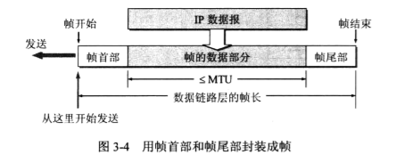
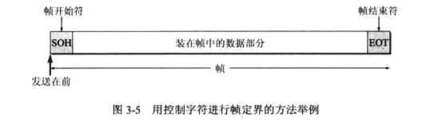

- `透明传输`

透明的意思是：某一个实际存在的事物看起来却好像不存在一样。“在数据链路层透明传送数据”表示无论什么样的比特组合数据，都能按照原样`没有差错`的通过数据链路层。对传送的数据来说，数据链路层`不会妨碍`他们传输。【`发出什么，就能接收什么,没有差错`】

在封装成帧中，SOH和EOT是`一串二进制`，当数据`存在相同的二进制时`，接收端就会错误的以为是帧的开始或帧的结束，那要怎么解决呢？转义字符“ESC”！通过字节填充（字符填充）转义字符的方式，只要在转义字符后面的SOH或EOT就不是真正的SOH或EOF，接收端删掉转义字符就能得到原来的数据了。

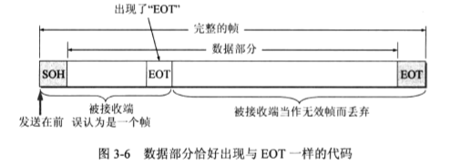
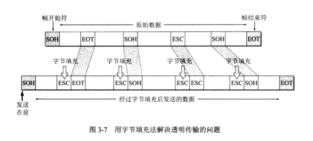

透明传输举例：

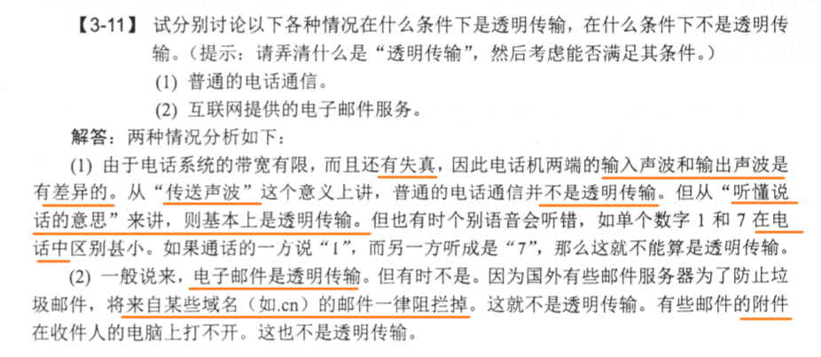

- `差错检测`

`循环冗余检验CRC`：使用`模2运算算法`生成的`帧检验序列FCS`

该算法不难，手写一遍就知道了。

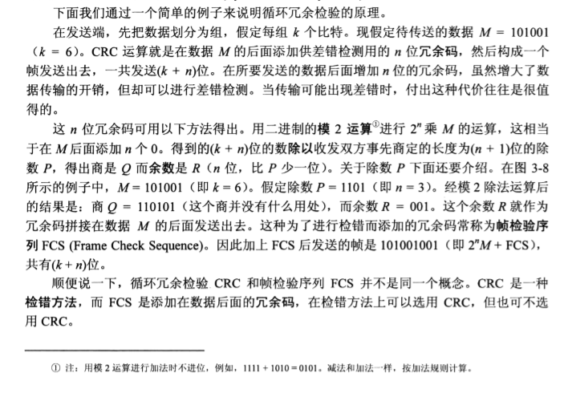
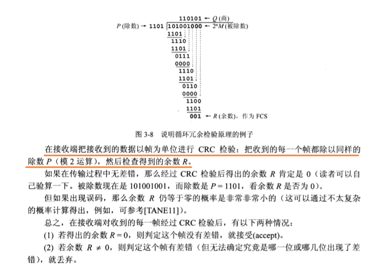

该算法的原理为：  

利用计算机的加法不进位：A+B=A-B（1111+1010=0101，1111-1010=0101）

### 适配器

我们来讲一下计算机使如何连到局域网上的。

- 名称

计算机与外界局域网的连接是通过通信`适配器（adapter）`进行的。适配器原先是主机箱内的一块网络接口板（简称“`网卡”`）。由于现在的计算机主板都嵌入这种适配器，不再单独使用网卡，所以适配器是一个更加准确的术语。`适配器实现的功能包含“数据链路层”和“物理层”两层的功能`。现在的芯片的集成度都很高，很难把适配器的功能按照层次精确分开。

- 组件

在通信适配器上有`处理器`和`存储器（包括RAM和ROM）`。

- 作用

处理器：

适配器和局域网之间的通信是通过`电缆或双绞线以串行传输方式`进行的，而适配器和计算机之间的通信则是通过计算机`主板上的I/O总线以并行传输方式`进行的。因此，适配器的一个重要功能就是要进行数据`串行传输和并行传输的转化`。

当然，在主板插入适配器时，还必须安装管理该适配器的`设备驱动程序`。这个驱动程序以后会告诉适配器，应当从存储器的什么位置上把多长的数据块发送到局域网，或者应当在存储器的什么位置上把局域网的数据存储下来。

适配器还需要能够实现`以太网的协议`。

适配器`接收和发送各种帧`不使用计算机的CPU。这时的CPU可以处理其他任务。当适配器收到有差错的帧时，就把这个帧`丢弃而不必通知计算机`。当适配器收到正确的帧时，它就使用`中断来通知计算机`并交付协议栈中的网络层。

存储器：

由于网络上的数据率和计算机总线上的数据率并不相同，因此适配器有`缓存`芯片。

`MAC地址`写在适配器的“`ROM`”中，而IP地址则写在计算机的存储器中。

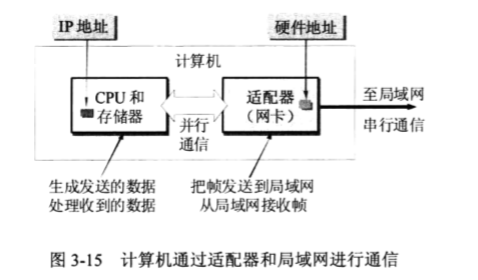

### 局域网

局域网（`Local Area Network`,LAN），是指在某一区域内由多台计算机互联成的计算机组。

局域网可以实现文件管理、应用软件共享、`打印机共享`等。`校园网`属于局域网，通过一个或者多个网关与外部连接。

局域网可按照网络拓扑进行分类。

- 星形网：利用Hub（集线器）和双绞线
- 环形网
- 总线网：`以太网（现在以太网几乎成了局域网的代名词），双绞线已经称为局域网内的主流传输媒体。当传输率很高时，往往需要使用光纤作为传输媒体`

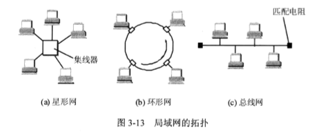

必须指出，`局域网工作的层次跨越了数据链路层和物理层`。

因为局域网是有多台主机，而这些主机需要共享信道。以太网采用的是多点接入（又称为动态媒体接入控制，信道不是固定分配给用户的）中的随机接入（所有的用户可以随机的发送信息。并用碰撞检测来防止在信道中传输多个信息）

#### CSMA/CD协议（总线网）

`以太网采用的是CSMA/CD协议。`

`总线`的特点是：当一台计算机发送数据时，总线上的所有计算机都检测到这个是数据。这种是`广播通信方式`。但是总线也需要进行`一对一通信`，这是就需要`MAC地址`加入到帧中。适配器对不是发送给自己的数据帧就丢弃。

人们常把局域网上的计算机称为“主机”，“工作站”，“站点”，或“站”。

在以太网中通信采用的是以下措施：

1. 采用无连接的工作方式，以太网提供的服务是尽最大努力的交付，即`不可靠交付`。（对有差错帧是否需要重传则由高层决定，当高层的TCP决定重传时，以太网并不知道这个是重传帧，而是当作新的数据帧来发送）
2. 以太网发送的数据都使用`曼彻斯特编码`的信号。（优点是在一个`时间间隔`内可以很好的`区分高低电压`，缺点是它所占的频带宽度比原始的基带信号增加了一倍（因为每秒传送的码元数增加了））

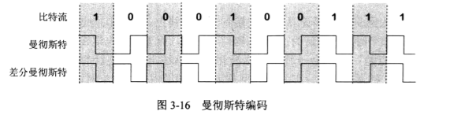

`CSMA/CD`（Carrier Sense Multiple Access with Collision Detection，`载波监听多点接入/碰撞检测`）的要点如下：

1. “多点接入”说明这是`总线型网络`，许多计算机以多点接入的方式连接在一根总线上。协议的实质是“载波监听”和“碰撞检测”。
2. “载波监听”的目的是`检测信道`。不管在发送前，还是在发送中，每个站都必须不停地检测信道。`在发送前检测是为了获取发送权，在发送中检测是碰撞检测`。
3. “碰撞检测”也就是“边发送边监听”，即适配器边发送数据边检测信道上的信号`电压的变化情况`，以便判断自己在发送数据时其他站是否也在发送数据。当几个站同时在总线上发送数据时总线上的信号电压变化服务将会增大（互相叠加）

接下来，我们详细讲一下“`碰撞检测`”：

因为电磁波在总线上是以有限的速度传播的，因此在不同主机间传播是会有时延的。`电磁波在1km电缆的传播时延约为5us`(这个数字应当记住)。

在局域网的分析中，常把`总线上的单程端到端传播时延τ`（tao）,从图我们易知A发送数据后，最慢要两倍的总线端到端的传播时延（2τ，也即总线的端到端的往返传播时延）才能知道有没有发生碰撞，2τ也称为争用期。

**应该记住：**2τ为争用期的时间，在10Mbit/s是512比特时间，为5.12us

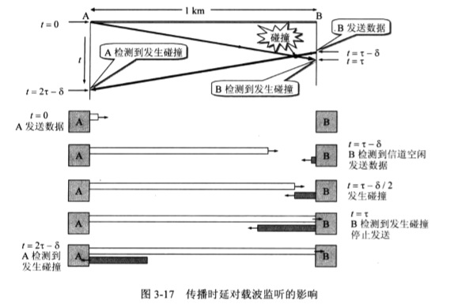

因为在总线上，使用CSMA/CD，一个站不可能同时进行发送和接收（但必须边发送边监听信道）。因此使用CSMA/CD协议的以太网只能进行双向交替通信（半双工通信）。

当出现碰撞，通信的A、B要怎么做呢？

以太网使用截断二进制指数退避（truncated binary exponential backoff）算法来确定碰撞后重传的时机。算法如下：

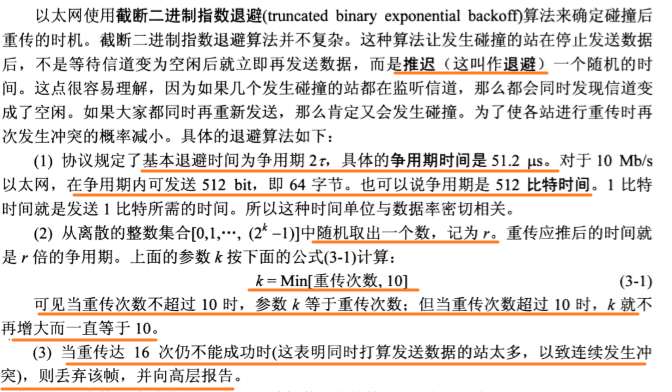
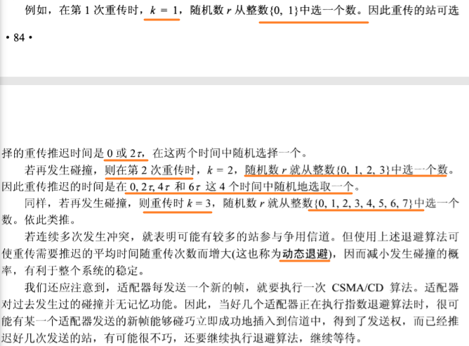
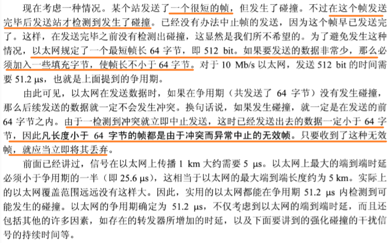

同时，当发生碰撞时，以太网应该让所有的用户都知道，于是检测到碰撞后，以太网除了停止发送数据外，还继续发送32比特或48比特的人为干扰信号（jamming signal），以便让所有的用户都知道现在发生了碰撞。

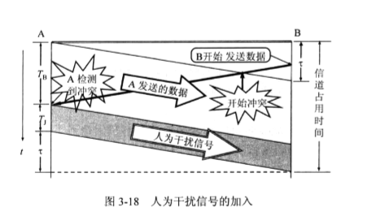

##### 总结

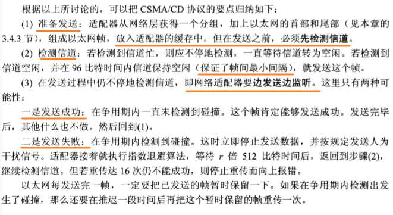

#### 以太网的信道利用率

以太网的信道利用率是不能到达100%的。据统计，当以太网的利用率到达30%的时候，就会产生大量的碰撞，很多网络容量被网上的碰撞消耗掉了。

#### 以太网的MAC层

在局域网中，硬件地址又称为物理地址或MAC地址。现在的MAC地址都是6个字节（48位）。

MAC地址是由IEEE的注册管理机构RA（Registration Authority）管理前三个字节，且第一个字节的最低位为I/G位（Individual/Group），当I/G为0时，地址字段表示单个站地址，为1是代表组地址，用来多播（像广播地址为全1）。

MAC地址可以用来干嘛呢？我们知道适配器由过滤功能，如果MAC地址是这个适配器的，那么适配器会收下（如果是广播地址也会收下），如果不是该适配器的地址，适配器就不会收下。

当然，你的适配器也可以设置成混杂模式，在混杂模式下，适配器可以悄悄地收下所有的以太网帧。

##### MAC帧的格式

- 目的地址和源地址都是6个字节
- 第三个字段是：类型，标志上一层使用的是什么协议，以便把收到的MAC地址帧的数据交到上一层这个协议。如0x0800是IP数据报。
- 第4个字段数据字段，长度在46~1500之间（46=帧的最少为64字节-18的帧的首部和尾部，1500为MTU）
- 第5个字段是帧检验序列FCS（使用CRC检验）
- 一个帧发送完毕后，会等待9.6us才会发送下一个帧（帧的最小间隔），所以可以没有EOT（End Of Termission）
- 同时会在一个帧的首部加上8个字节。目的是为了是适配器的时钟和比特流达成同步。（SOH）

#### 使用集线器的星型拓扑（星型网）

人们发现`有源器件`（需要电源的器件）能够减少故障的发现，以太网渐渐的采用了`星型拓扑`的结构。

星型的中心采用增加了`集线器（Hub）`，并且使用`双绞线`，在1990年推出了以太网`10BASE-T`标准的802.3i(10代表10Mbit/s的数据率，BASE表示基带信号，T代表双绞线)。

**集线器的特点如下：**

1. 使用集线器的以太网在逻辑上仍是一个总线网，使用的还是`CSMD/CD协议`（更具体地说，是各站中的适配器执行CSMA/CD协议）。网络中各站必须竞争传输媒体的控制，并且在同一时刻只允许一个站发送数据。
2. 集线器有多个接口，像一个`多接口转发器`。
3. 集线器工作在`物理层`，它的每一个接口仅仅简单的转发比特--收到1就发1，不进行碰撞检测。

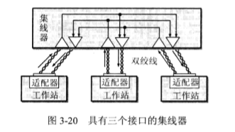

集线器本身非常可靠，现在的堆叠式集线器由4~8个集线器堆叠起来。集线器有少量的容错能力和网络管理能力，且支持热插拔。

IEEE802.3标准还可以使用光纤作为传输媒体，相应的标准是10BASE-F系类，F代表光纤。

#### 拓展以太网（Hub，Switch）

通过Hub，Switch对以太网的覆盖范围进行拓展，这种拓展的以太网在网络层看起来仍然是一个网络。

##### 物理层拓展以太网（Hub）

- 转发器：中继器放大器，可以对（由于铜线的距离传输的）衰减信号起到放大作用。但是由于随着双绞线以太网成为主流，现在已不用了。

- 光纤调制调解器：用于电信号和光信号的转换。（由于光纤的时延很小，并且宽带很宽，因此很容易使主机和几公里外的集线器相连）

- Hub：可以连接成覆盖更大范围的多级星形结构的以太网（集线器之间可以使用双绞线或光纤）。（现在也不用了）

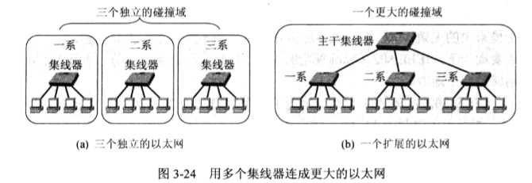

但是这样子也有缺点：由于碰撞域（又称冲突域，CSMD/CD的碰撞检测）使得吞吐量急速下降。

##### 数据链路层拓展以太网（Switch）

- 网桥（bridge）：是交换机的低级版本（现在也不用了）

- 交换机集线器（switching hub）,也常称为`以太网交换机`（`switch`）或第二层交换机（L2 switch）。是网桥的升级版。

**交换机的特点：**

1. `多接口网桥`，通常有十几个或更多的接口。
2. 以太网具有`并行性`，能够同时联通多个接口，使得多对主机能够相互通信，`相互通信的主机都是独占传输媒体，无碰撞地传输数据`。
3. 但是，还需要有一个`存储器`。如果连接在以太网的两台主机，同时向另一台主机发送帧，那么当这台主机的接口繁忙时，发送帧的两台主机的接口会把收到的帧暂存一下，以后再发出去。
4. 以太网交换机内部有`帧交换表`（`地址表`），可以通过`自学习算法`建立帧交换表。所以以太网交换机是一种即插即用的设备。

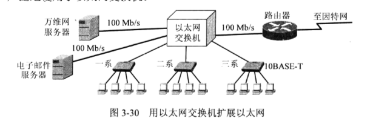

- 以太网交换机的自学习功能：[点击跳转](https://floatlig.github.io/computerNetwork_docsify/#/./_source/%E8%AE%B2%E8%AE%B2%E4%BA%A4%E6%8D%A2%E6%9C%BA%E4%B8%8EVLAN%EF%BC%9A%E5%8A%9E%E5%85%AC%E5%AE%A4%E5%A4%AA%E5%A4%8D%E6%9D%82%EF%BC%8C%E6%88%91%E8%A6%81%E5%9B%9E%E5%AD%A6%E6%A0%A1)

- 拓展知识：大二层网络--IP数据包的新的传送方式 <http://www.iqiyi.com/w_19s07fvytp.html>
- 把一台电脑设置成局域网服务器 <https://jingyan.baidu.com/article/60ccbceb492c1564cab19728.html>

**广播域、冲突域：**

- `广播域`就是说如果一个站点发出一个广播信号后能接收到这个信号的范围。通常来说，`一个局域网就是一个广播域`【ARP协议发的包在局域网内寻找MAC地址】。
- `路由器隔离广播域`，即：路由器有多少个接口，就有多少个广播域
- `交换机隔离冲突域`【交换机能够使主机在通信时，不产生碰撞】，即：交换机有多少个接口，就有多少个冲突域
- `网桥隔离冲突域`
- `VLAN可以隔离广播域`

##### 从总线以太网到星形以太网

总线以太网使用CSMA/CD协议，以半`双工方式`工作。

但是`以太网交换机不使用共享总线，没有碰撞问题，因此不适用CSMA/CD协议，而是以全双工方式工作`。

但是，无论是总线型以太网还是星形以太网，帧的结构都没有改变。

#### 虚拟局域网

利用以太网交换机可以很方便的实现虚拟局域网`VLAN（Virtual LAN）`,利用的原理是：`改变帧的结构`（VLAN帧，在原来帧的基础上`增加了一个明确的标识符`，指明发送这个帧的计算机是属于哪一个VLAN）

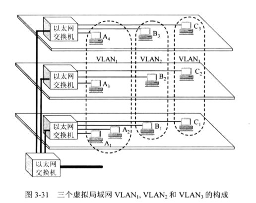

在上图的虚拟局域网中，没有加粗的线传送的是帧，而加粗的线传送的是802.1Q帧，以太网交换机会自动转换

#### 高速以太网

IEEE802.3u的10Mbit/s以太网标准未包括对同轴电缆的支持，若要升级到100Mbit/s，需要重新布线。现在的10/100Mbit/s以太网多使用多屏蔽双绞线布线。
