### 网络层要怎么设计

网络中有一个很重要的话题：`可靠交付`由谁来负责？网络才是端系统？

因为`计算机有着很强的差错处理能力`，互联网采用的设计思路和传统电话线完全不一样（传统电话线，需要运输的时候需要先建立连接，可以说，可靠交付由网络负责），互联网采用的思路是：`网络层向上只提供简单灵活的、无连接的、尽最大努力交付的数据报服务。`网络层不提供服务质量的承诺，可靠交给运输层负责；通过这样子，使得网络造价大大降低，运行方式灵活，能够适应多种应用。

这里`IP数据报`，又叫做`数据报`、`分组`。

### 网际协议IP

`网际协议IP`是TCP/IP体系中最主要的协议之一，与IP协议配套使用的还有：

- `网际控制报文协议ICMP`（Internet Control Message Protocol）
- `网际组管理协议IGMP`（Internet Group Management Protocol）
- `地址解析协议ARP`（Address Resolution Protocol）

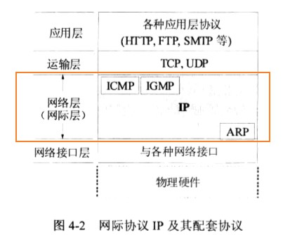

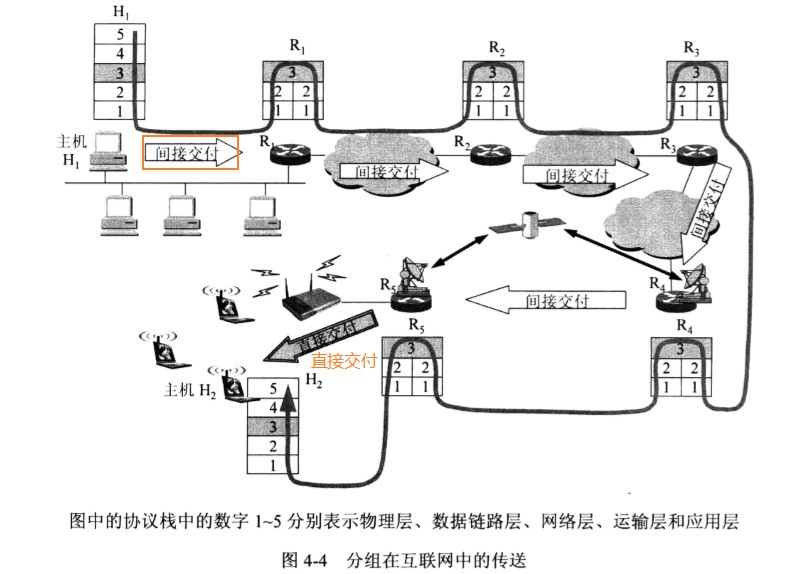

#### 虚拟互联网络

一般来讲，使网络互联起来的设备有：

- 物理层：转发器（repeater）、集线器（hub）、中继器
- 数据链路层：网桥、桥接器（bridge）、交换机（switch）
- 网络层：路由器（router）、网关（gateway）

使用IP协议，使得互联后的网络看起来像是`一个统一的网络`（即使物理网络存在异构型）。

如果在覆盖全球的IP网的上层使用TCP协议，那么就是现在的互联网。互联网能提供大量丰富的服务：

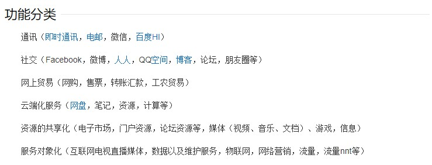

#### 分类的IP地址

IP地址(由网络号和主机号组成)就是给互联网上的每一台主机（或路由器）的每一个接口分配一个在全世界范围内是唯一的32位标识符。

IP地址编址方法经历了三个历史阶段：

1. 分类的IP地址（A B C D E 五类）【成为历史】
2. 子网的划分【成为历史】
3. 构成超网（CIDR）【目前在用】 [参考链接](https://floatlig.github.io/computerNetwork_docsify/#/./_source/%E8%AE%B2%E8%AE%B2ifconfig?id=%e4%b8%80%e4%b8%aa%e5%ae%b9%e6%98%93%e7%8a%af%e9%94%99%e7%9a%84cidr)

在IP地址中，有 一些特殊的IP：

- 主机号`全1代表所有的主机`，`全0代表本主机`；
- 网络号全0、全1代表`本网络`；
- 127的网络号，非全0或全1的任何数（如`127.0.0.1`）代表本地软件`环回测试`。

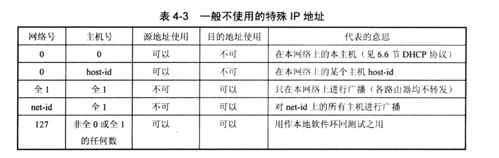

IP地址，是分配给网卡，路由器的端口的

- 因此，一个网卡（网络适配器）有一个IP地址，一个电脑有多少个网卡，`可以`有多少个IP地址。
- 一个路由器一个端口对应一个IP地址，一台路由器有5个端口，`可以`有5个IP地址。

路由器的WAN口、LAN口、以及NAT转换：[参考链接](https://product.pconline.com.cn/itbk/wlbg/network/1802/10851136.html)

#### IP数据报的格式

`IP数据报能够说明IP协议有什么功能。`在TCP/IP的标准中，各种数据常常`以32位（即4字节）为单位`描述。

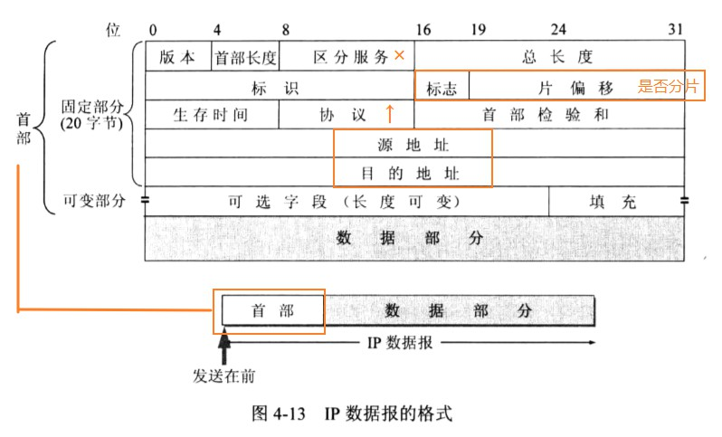
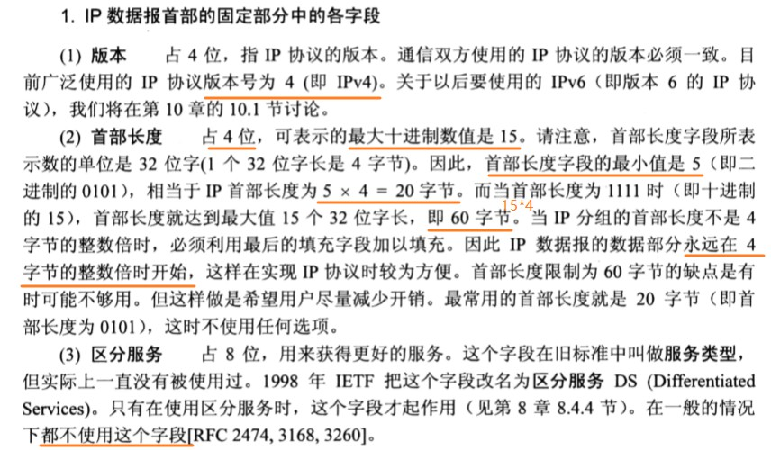
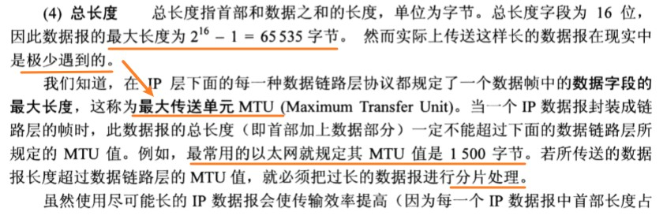
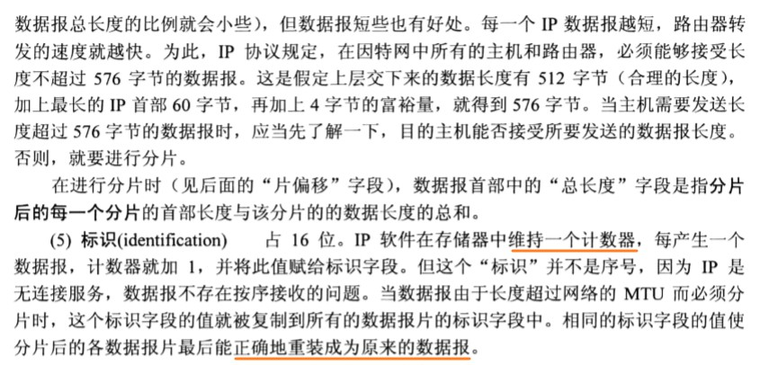
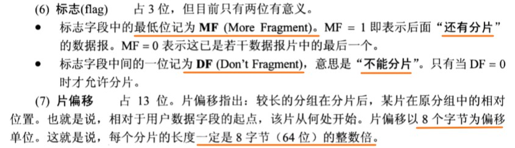
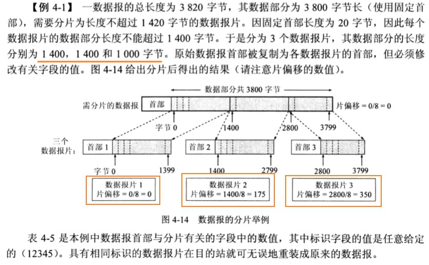
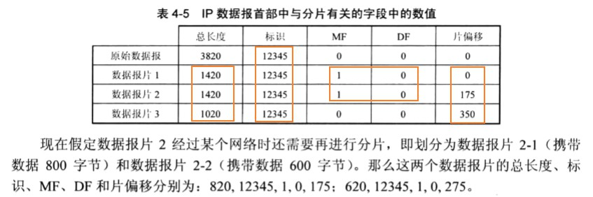
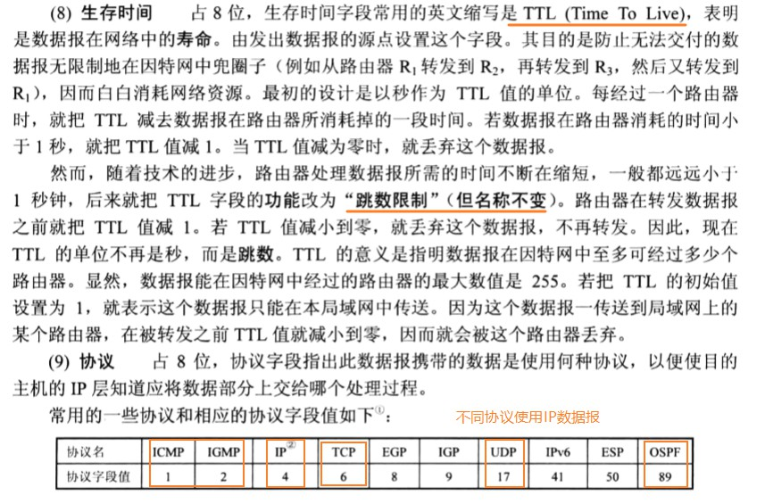
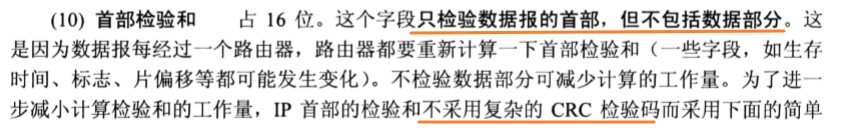
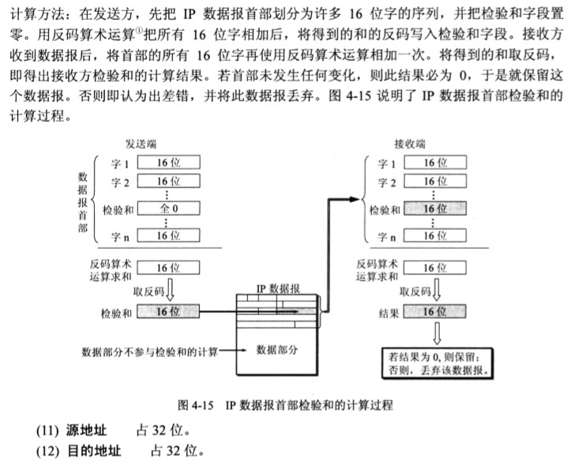

#### 划分子网和构造超网

IP地址分为A B C D　E五类，这样子的设计不够合理。

- IP地址空间`利用率有时很低`

有的单位申请到了一个B类的地址网络，但是所连接的主机数并不多，可以又不愿意申请一个C类地址。

- 给每一个物理网络分配一个网络号会使路由表变得太大而使网络性能变坏

每个路由器都应该能从路由表查出应怎么到达其他网络的下一跳路由器。因此，互联网的网络数足够多，路由器的路由表的项目也越多。

这样，即使我们拥有足够多的IP地址资源，但是也会导致路由器的路由表中的项目数过多，这不仅增加了路由器的成本（需要更多的存储空间），而且使查找路由时耗费更多的时间。

- 二级IP地址不够灵活

二级的IP地址必须到互联网管理机构去申请，如果一个单位需要增加一个新的网络，二级IP地址无法做到这一点。

为了解决上述问题，从1985年开始，又增加了一个“子网号字段”，使两级IP地址变为三级IP地址，能够较好的解决上述问题。这种做法称为划分子网（子网寻址或子网路由选择）

划分子网的基本思路如下：

1. 一个拥有许多物理网络的单位，可将所属的物理网络划分为若干个子网。划分子网纯属一个单位内部的事情。本单位外网络看不见这个网络是由多少个子网组成的，因为这个单位对外仍表现为一个网络。
2. 划分子网的方法是从主机号借用若干位作为子网号（subnet-id）,当然主机号也要减少同样的位数。
3. 外界发来的数据报，认识根据目的网络号找到找到连接在本单位网络上的路由器。当此路由器收到IP数据报后，再按目的网络号和子网号找到目的子网，把IP数据报交付目的主机。

##### 子网掩码

子网掩码是一个网络或一个子网的重要属性。

规定：路由器在和相邻路由器交换路由信息时，必须把自己所在网络（或子网）的子网掩码告诉相邻路由器。

##### 使用子网时分组的转发

在划分子网时，分组转发的算法必须做相应的改变。

在使用子网划分后，路由表必须包含以下三项内容：目的网络地址、子网掩码和下一跳地址。

在划分子网的情况下，路由器转发分组的算法如下：

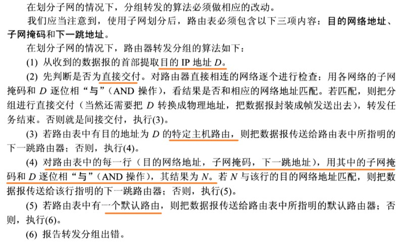
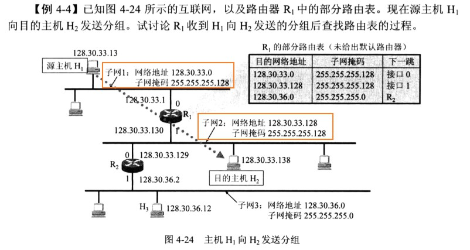
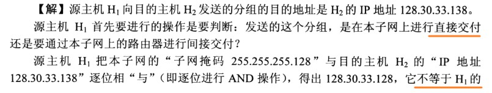
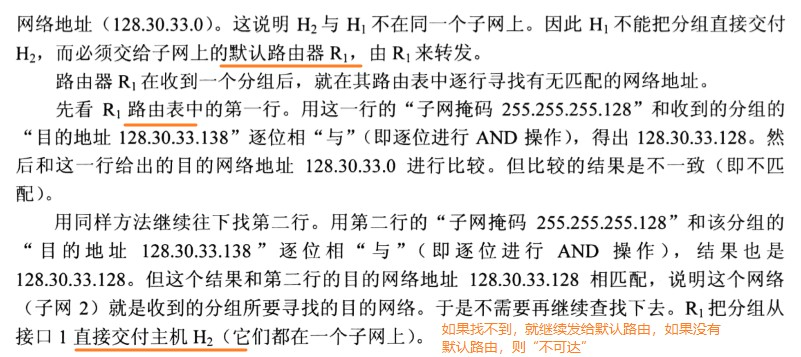

#### 无分类域间路由选择（CIDR）（构造超网）

无分类域间路由选择CIDR（Classless Inter-Domain Routing, CIDR的读音是“sider”）

CIDR最主要的特点有两个：

1. CIDR消除了传统的A类、B类和C类地址以及划分子网的概念（突破了A B C类等），同时CIDR还使用“斜线记法”（slash notation）,或称为“CIDR记法”。
2. CIDR把网络前缀都相同的连续IP地址组成一个“CIDR地址块”。

由于一个CIDR地址块中有很多地址，所以在路由表中就利用CIDR地址块来查找目的网络。这种地址的聚合常称为路由聚合（route aggregation）。路由聚合有利于减少路由器之间的路由选择信息的交换，从而提高了整个互联网的性能。

#### IP地址和MAC地址

物理地址是数据链路层和物理层使用的地址，而IP地址是网络层和以上层使用的地址，是一种`逻辑地址`。

### 地址解析协议ARP

每一台主机都有一个`ARP高速缓存（ARP cache）`，用来存放IP地址到硬件地址的映射表，并且这个映射表还经常动态的更新（新增或超时删除）

ARP对保存在高速缓存中的每一个映射地址项目都设置`生存时间`（如10~20分钟），超过生存时间的项目就从高速缓存中删掉。

ARP的工作原理如下：

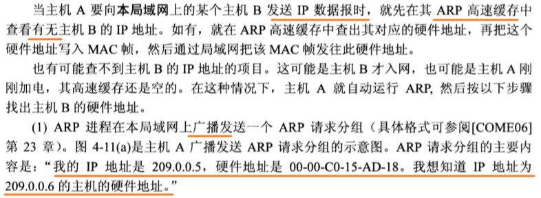
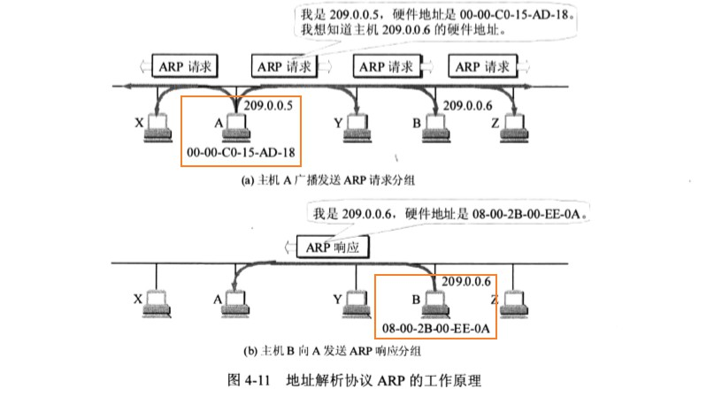
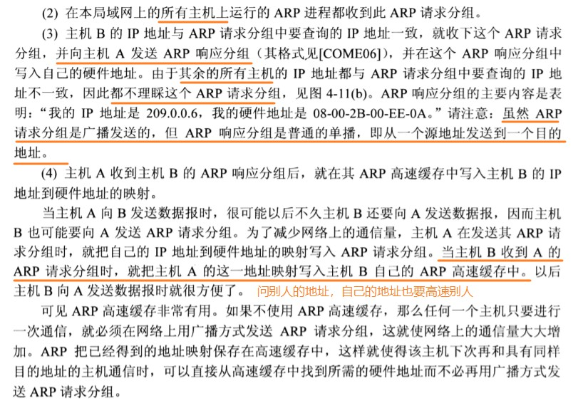
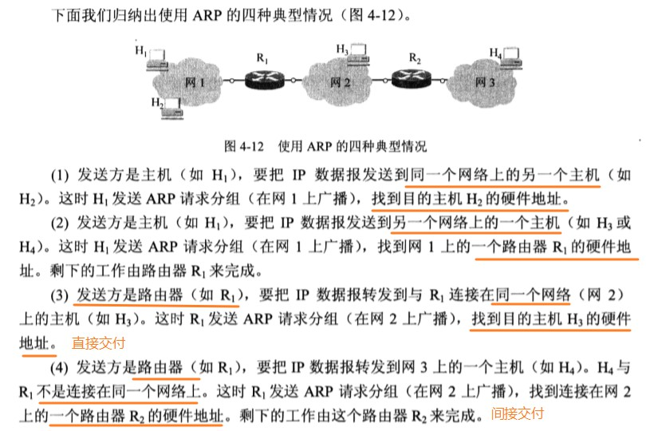

### 网际控制报文协议ICMP

为了更有效地转发IP数据报和提高交付成功的机会，在网际层使用了网际控制报文协议ICMP（Internet Control Message Protocol）。ICMP允许主机或路由器报告差错情况和提供有关异常情况的报告。

ICMP是报文是封装在IP数据报中，作为其中的数据部分，所以ICMP并不是高层协议。ICMP报文作为IP层数据报的数据，加上数据报的首部，组成IP数据报发送出去。ICMP报文格式如图所示：

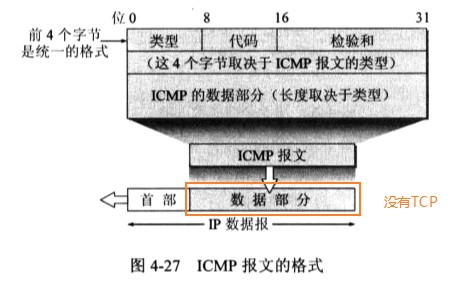

ICMP报文的种类有两种，即ICMP差错报告报文和ICMP询问报文。

- 代码字段是为了进一步区分某种类型的几种不同的情况。
- 检验和是用来检验整个ICMP报文。因为IP数据报首部的检验和并不检验IP数据报的数据部分的内容，因此不能保证经过传输的ICMP报文不产生差错。

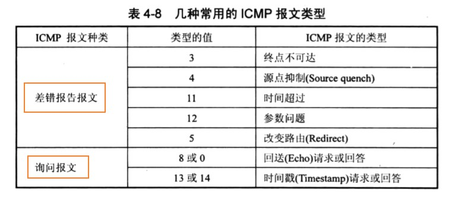

上图给出了ICMP差错报文的四种：

1. 终点不可达：当路由器或主机不能交付数据报是就向源终点发送中终点不可达报文。
2. 时间超过：当路由器收到生存时间为0的数据报时，除丢弃数据报外，还要向源终点发送时间超过报文。同时，当终点在预先规定的时间内不能收到一个数据报的全部数据报片时，就把已收到的数据报片都丢弃，并向源重点发送时间超过报文。
3. 参数问题：当路由器或目的主机收到的数据报的首部中有的字段的值不正确时，就丢弃该数据报，并向源终点发送参数问题报文。
4. 改变路由（重定向）：路由器把改变路由报文发送给主机，让主机知道下次应将数据报发送给另外的路由器（可通过更好的路由）

【这里注意：端口不可达的报文是UDP的，不是ICMP的，用“tracert”命令后，用抓包工具试一下吧】

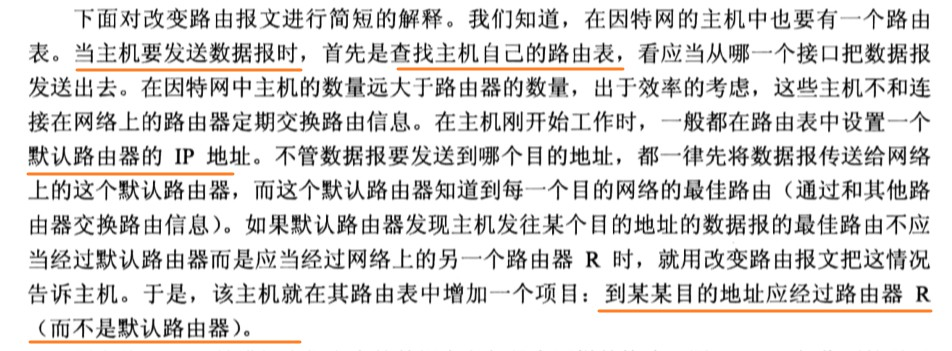

所有的ICMP差错报告报文中的数据字段都具有同样的格式。【IMCP数据报部分 + IP数据报部分 + TCP/UDP数据报部分】

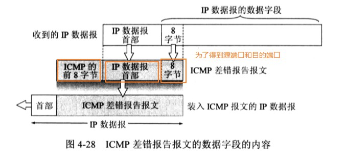

不应发送ICMP差错报告报文的几种情况：

1. 对ICMP差错报告报文，不再发送ICMP差错报告报文
2. 对第一个分片的数据报片的所有后续数据报片，都不发送ICMP差错报告报文
3. 对具有多播地址的数据报，都不发送ICMP差错报告报文
4. 对具有特殊地址（127.0.0.0或0.0.0.0）的数据报，不发送ICMP差错报告报文

常用的ICMP询问报文有两种：

1. 回送请求和回答：这种询问报文用来测试目的站是否可以以及了解其有关状态。
2. 时间戳请求和回答：时间戳请求与回答可用于时钟同步和时间测量。

#### ICMP的应用举例

ICMP的一个重要的应用就是ping，使用了ICMP回送请求与回送回答报文。

ping是应用层直接使用网络层ICMP的一个例子。它没有通过运输层的TCP或UDP（详看ICMP的报文的内容）

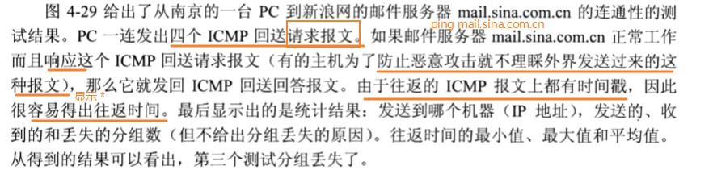
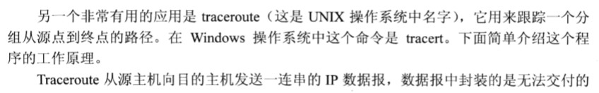
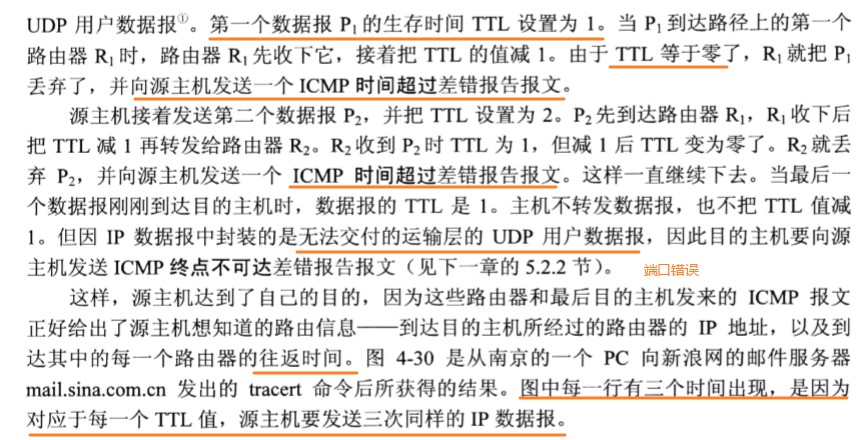

如何利用ping诊断网络问题：

1. ping 127.0.0.1；检查TCP/IP地址是否安装成功（127.0.0.1是环回地址，只会走到本机的网络层，不会走到本机的数据链路层） 
2. ping 本机IP；检查本地IP地址是否设置正确（windows下可通过ipconfig查看本地IP地址）
3. ping 缺省网关；（Windows下可通过ipconfig -all查看缺省网关）
4. ping 远程网段的IP

### 互联网的路由选择

路由选择协议的核心就是路由算法；即需要何种协议算法来获得路由表中的各项目。

倘若从路由算法能否随网络的通信量或拓扑自适应地调整变化来划分，则只有两大类，即静态路由选择策略与动态路由选择策略。

- 静态路由选择也叫做非自适应路由选择，其特点是简单和开销小，但不能及时地适应网络的变换。静态路由需要手工一条一条的输入
- 动态路由选择也叫做自适应路由选择，其特点是能够很好地适应网络地状态的变化，但实现起来比较复杂，开销也比较大。因此，动态路由选择适应大网络。

**分层次的路由选择协议：**

互联网采用的路由选择协议主要是自适应的（动态的）、分布式路由选择协议。

- 把整个互联网划分成许多小的自治系统AS
- 在一个AS内，AS可以自己选择内部网关协议IGP（Interior Gateway Protocol）：RIP、OSPF
- AS之间，使用外部网关协议EGP(External Gateway Protocol)：BGP

#### 内部网关协议RIP

RIP是一种分布式的，基于距离向量的路由选择协议，其最大的特点就是简单。

RIP要求网络中每一个路由器都要维护从自己到其他每一个目的网络的距离记录（一组距离，即“距离向量”）。

这里的距离也称为“跳数”，每经历过一个路由器，条数距离+1。RIP认为最大的跳数是15，当跳数为16时，即为不可达。

**和哪些路由交换信息？怎么交换信息？在什么时候交换信息？**

1. 仅和相邻路由器交换信息。
2. 

RIP的优点和缺点：

**优点：**

1. 简单

**缺点：**

1. 