### 运输层协议概述

从通信和信息处理的角度看，运输层向它上面的应用层提供通信服务（端口），它属于面向通信部分的最高层，同时也是用户功能的最底层。

当`网络的边缘部分中的两台主机`使用网络的核心部分的功能进行`端到端的通信`时，只有主机的`协议栈才有运输层`，而网络核心部分中的`路由器`在`转发分组`时，都只用到下三层的功能【因为在分组转发中，不用直接交付，也用不到端口】。

从IP层的角度来说，通信的两端是两台主机。IP数据报的首部明确地标志了两台主机的IP地址。但“两台主机之间的通信”不是很明确。这是因为，`真正进行通信的实体是进程，是这台主机的一个进程和另一台主机的另一个进程在交换数据。`

因此，运输层有一个很重要的功能--复用（multiplexing）和分用（demultiplexing）。

- 复用：是发送方不同的应用进程都可以使用同一个运输层协议传送数据（还要加上适当的首部）
- 分用：是指接收方的运输层在剥去报文的首部后能够把这些数据正确交付目的应用进程

`运输层提供应用进程间的逻辑通信，而这，需要应用端口。`

#### 运输层的两个主要的协议

运输层有两个主要的协议：用户数据报协议UDP（User Datagram Protocol）、传输控制协议TCP（Transmission Control Protocol）

- TCP是面向连接的，是逻辑上的一条全双工的可靠信道（尽管下面的网络层是不可靠的），但是TCP不提供广播和多播服务，且为了可靠连接需要占用许多处理机资源；单位是TCP报文段
- UDP是无连接的，逻辑上仍是不可靠信道，但是UDP在某些方面下是最有效的工作方式；单位是UDP用户数据报

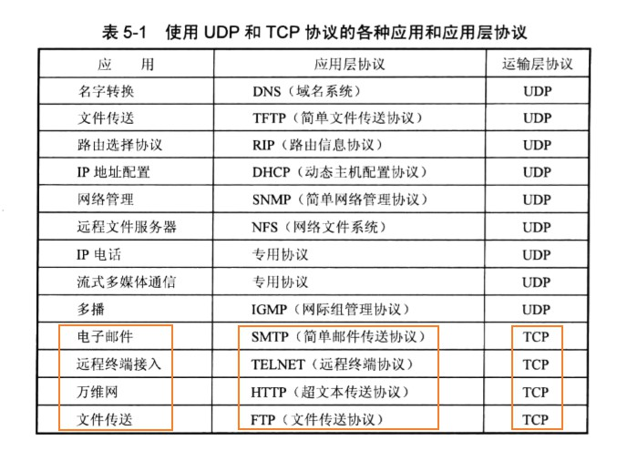

#### 运输层的端口

软件端口是应用层各种进程与运输实体层间交互的一种`地址`。在TCP、UDP中有源端口和目的端口这两个重要的字段

- 服务器端使用的端口

这里有两类，一类是熟知端口号（well-known port number）或系统端口号，数值为0~1023。

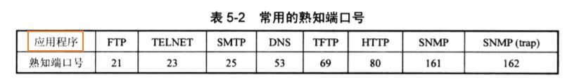

另一类是登记端口号。数值为1024~49151。这类端口号是为没有熟知端口号的应用程序使用的。使用这类端口号必须在IANA按照规定的手续登记，以防重复。

|  应用  | 端口号 | 运输层协议 |
| :----: | :----: | :--------: |
| Mysql  |  3306  |    TCP     |
| Oracle |  1521  |    TCP     |
| Tomcat |  8080  |            |

- 客户端使用的端口号

数字为49152~65535。这类端口号仅在客户进程运行时才动态选择，因此又叫短暂端口号。

#### 用户数据报协议UDP

用户数据报协议UDP只在IP数据报的基础上增加了很少的功能，这就是分用和复用【端口】的功能以及差错检错的功能。

UDP的主要特点是：

1. UDP是无连接的
2. UDP使用尽最大努力交付，即不保证可靠交付
3. UDP是面向报文的。发送方的UDP对应用程序交下来的报文，既不合并、也不拆分，而是保留这些报文的边界，直接添加首部后就向下交付IP层。也就是说，UDP一次交付一个完整的报文。因此，应用程序必须选择合适大小的报文。若报文太长，在IP层则需要分片；若报文太短，则IP数据报的首部相对较长，效率不高
4. UDP没有拥塞控制。因此网络出现拥塞不会使源主机的发送速率降低。对IP电话、实时视频会议等还是很重要的；但是没有拥塞控制，可能会导致网络产生严重的拥塞问题。
5. UDP支持一对一、一对多、多对一的交互通信方式
6. UDP首部开销小

##### UDP的首部格式

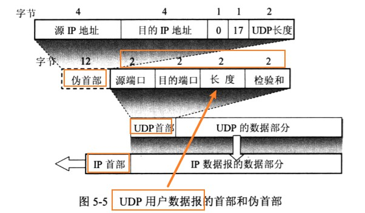

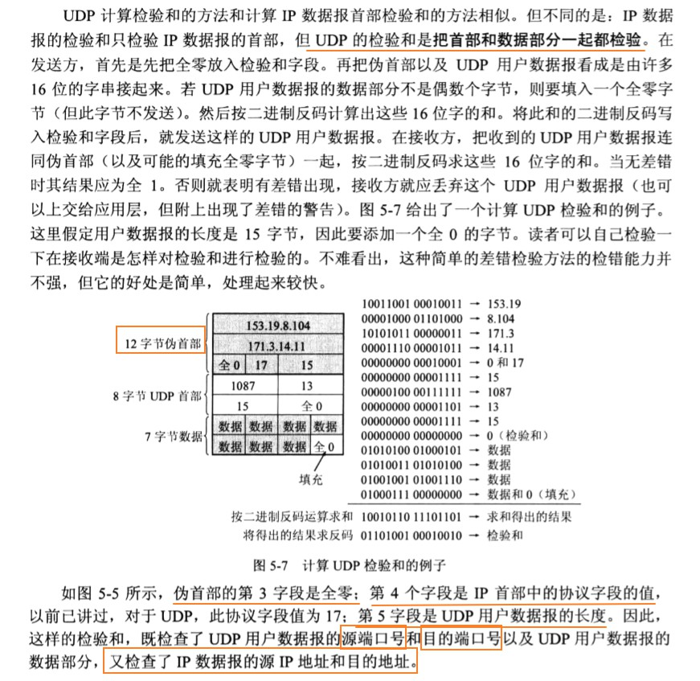

如果接收方UDP发现报文中的目的端口号不正确（即不存在对应该端口号的应用进程），就丢弃该报文，并丢弃该报文，并由`网际控制报文ICMP发送“端口不可达”差错报文`给发送方。(tracert，就是发送的UDP用户数据报报告一个非法的UDP端口，结果ICMP就发送“端口不可达”差错报文，因而达到测试的目的)

#### 传输控制协议TCP

TCP的主要特点：

1. TCP是`面向连接的运输层协议`：跟打电话一样，使用TCP协议之间，必须先建立连接，在传输数据完毕后，必须释放已经建立的连接。
2. 每一条TCP只能`点对点`
3. TCP`提供可靠交付`的服务
4. TCP提供`全双工通信`：TCP允许通信双方的应用进程`在任何时候都能发送数据`。TCP连接在两端都设有`发送缓存`和`接收缓存`，用来临时存放双向通信的数据。在发送时，应用程序在把数据传送给TCP缓存后，就可以做自己的事，而TCP在合适的时候把数据发送出去。在接收的时候，TCP把收到的数据放入缓存，上层的应用进程在合适的时候读取缓冲中的数据.
5. 面向字节流：TCP中的流是指`流入到进程或从进程流出的字节序列`

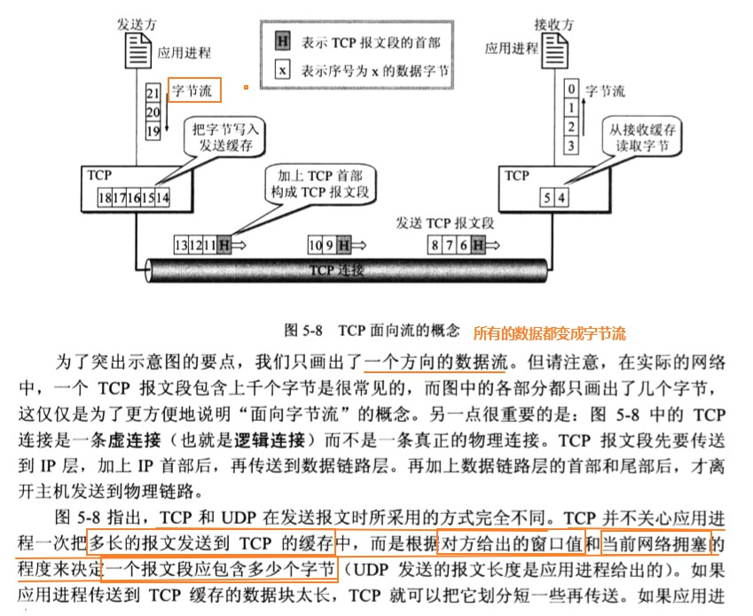

##### TCP报文段首部格式

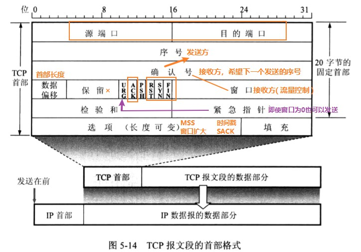
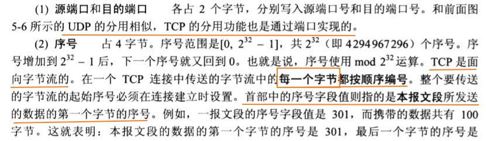
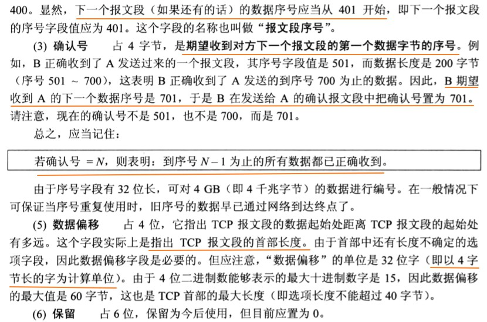
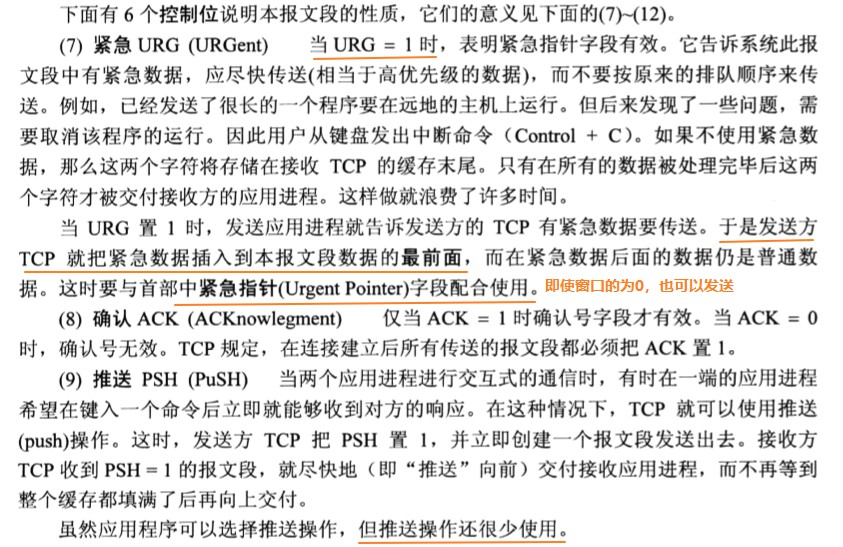
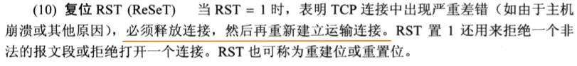
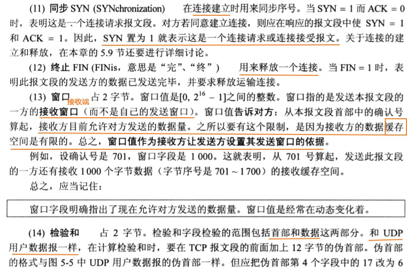
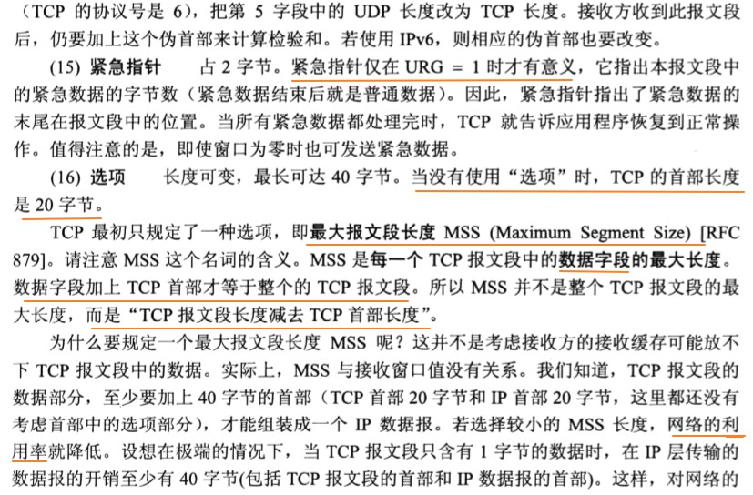
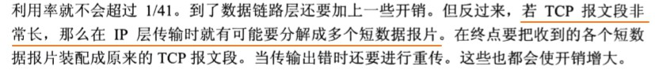
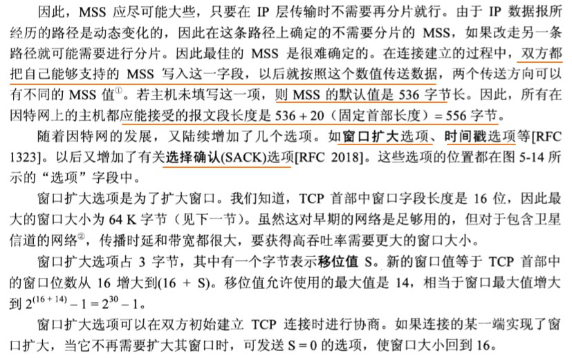
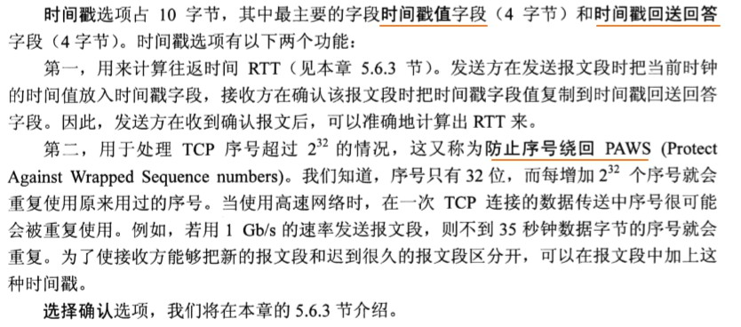

##### TCP的连接

TCP把连接作为最基本的抽象。每一条TCP连接有两个端点，TCP连接的端点叫做套接字（socket）或插口。

套接字 socket = （IP地址 ： 端口号）

##### 可靠传输的原理

虽然IP层只提供尽最大努力服务（不可靠的传输），但是在TCP层，我们可以使用可靠传输的协议，当出现差错时让发送方重传出现差错的数据，同时在接收方来不及处理收到的数据时，及时告诉发送方适当降低发送数据的速度。这样一来，本来不可靠的传输信道就能够实现可靠传输了。

##### 停止等待协议

全双工通信的双方既是发送方，也是接收方。但是为了方便，我们仅考虑A发送数据而B接收数据并发送确认。因此A叫做发送方，B叫做接收方。

“停止等待协议”就是每发送一个分组就停止发送，等待对方的确认。在收到确认后再发送下一个分组。

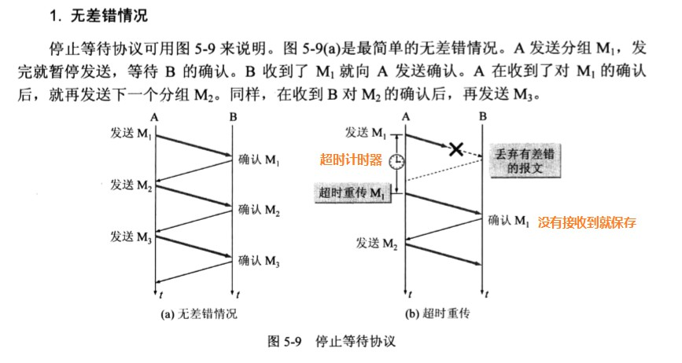
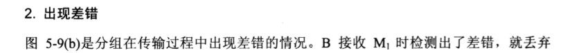
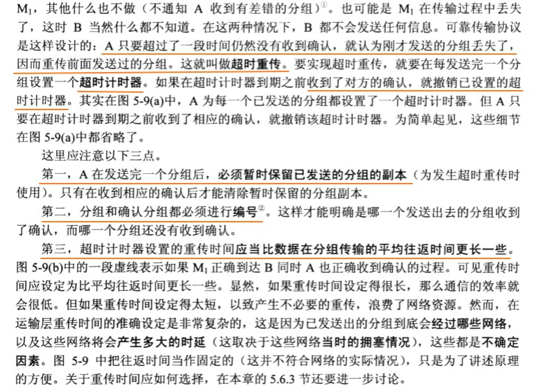
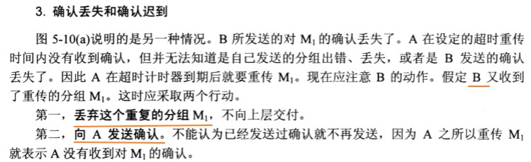
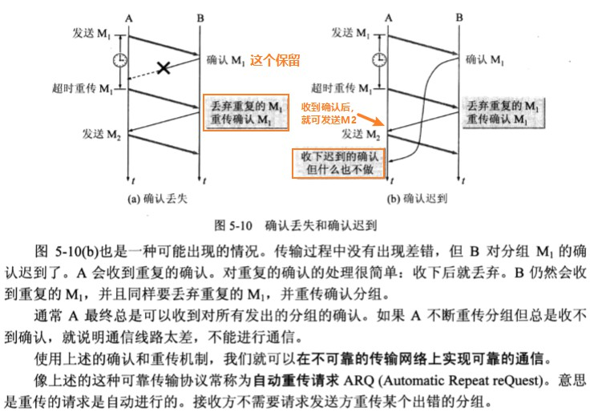
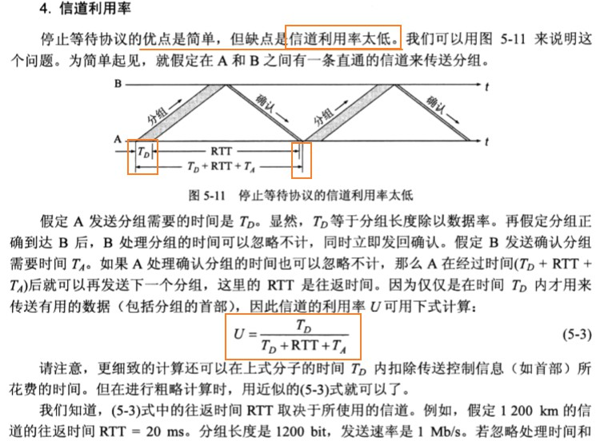
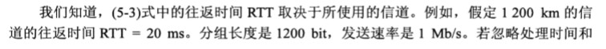
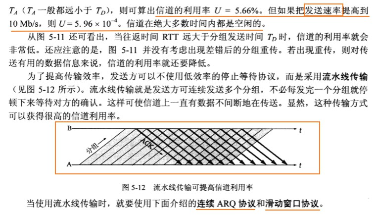

##### 连续ARQ协议

滑动窗口是TCP的精髓，这里先给出连续ARQ的基本概念。

图5-13(a)表示发送方维持发送端口，它的意义是：位于发送端口内的`5个分组都可以连续发送出去`，`而不需要等待对方的确认`。这样，信道利用率就提高了。

接收方一般是采用`累计确认`的方式。也就是说，接收方不必对收到的分组逐个发送确认，而是`在收到几个分组后`，对按序到达的`最后一个分组发送确认`，这就表示：到这个分组为止的所有分组都正确收到了。

但是，累计确认有优点也有缺点。`优点是：容易实现，即使确认丢失后也不必重传。但缺点是不能向发送方反映出接收方已经正确收到的所有分组的信息。`

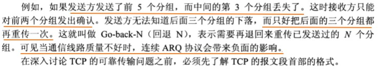

##### 以字节为单位的滑动窗口

TCP的滑动窗口是以字节为单位的。为了方便，我们故意把下面图例中的字节编号取得很小。

现假定A收到了B发来的确认报文段，其中`确认号`是31,而`窗口`是20字节，而(这表明B期望收到的下一个序号是31，而序号30为止的数据已经收到了)。`根据这两个数据，A就构造出自己的发送端口`：

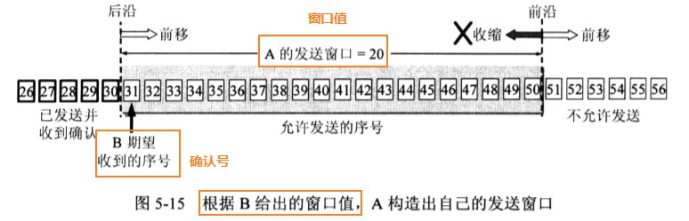

---

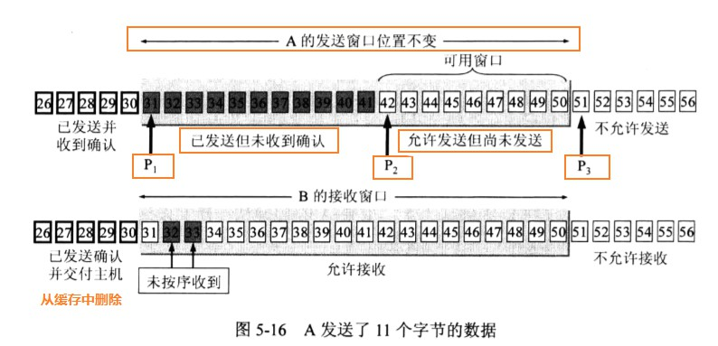

---

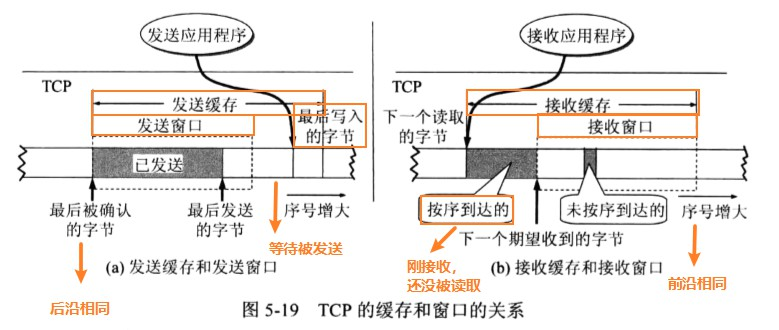

**A的发送窗口：**

1. 在没有收到B的确认的情况下，A可以连续把窗口内的数据都发送出去。
2. 以发送过的数据，在没有收到确认之前，必须暂时保留，以便在超时重传时使用

窗口的后沿和前沿都可以不动或向前移动；但是不能向后移动！后延不能向后移动，因为不能撤销确认过的报文，前延强烈不赞成向后移动，因为很有可能发送方已经发送了很多数据，但是现在又说不能发送后面的一些数据，这样子会产生一些错误。

**A的发送缓存用来存放：**

1. 发送应用程序传送给TCP准备发送的数据
2. TCP已发出但是未收到确认的数据

**B的接收缓存用来存放：**

1. 按序到达的、但尚未被接收应用程序读取的数据
2. 未按序到达的数据

**还要再强调几点：**

1. 虽然A的发送端口是根据B的接收窗口设置的，但是发送方A还可能根据网络当时的拥塞情况适当减少自己的发送端口
2. TCP有累计确认的功能，这样子可以减少传输开销。
3. TCP的通信时全双工通信。通信中的每一方都在发送和接收报文段。因此，每一方都有自己的发送端口和接收端口。

##### 超时重传时间的选择

运输层的超时重传时间应该设置为多大呢？

[超时重传1.jpg](../../_img/超时重传1.jpg)
[超时重传2.jpg](../../_img/超时重传2.jpg)
[超时重传3.jpg](../../_img/超时重传3.jpg)
[超时重传4.jpg](../../_img/超时重传4.jpg)