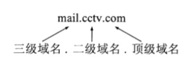
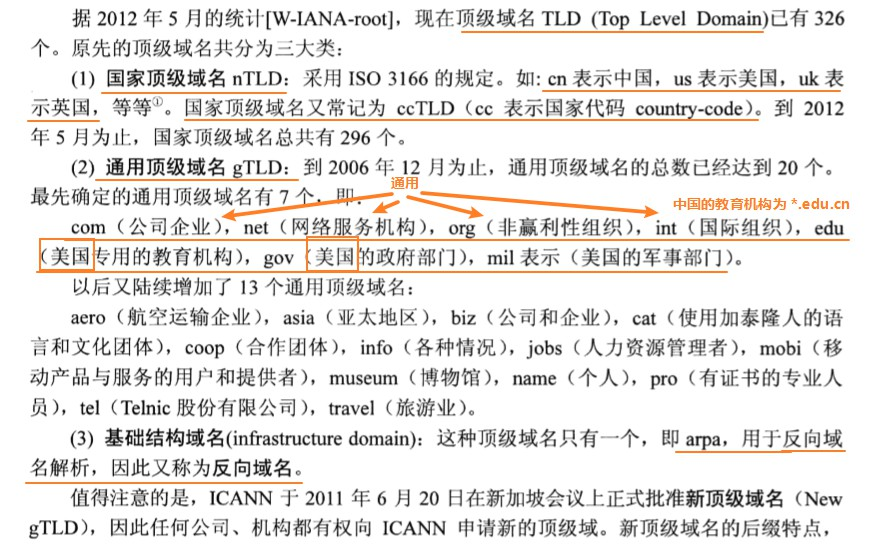
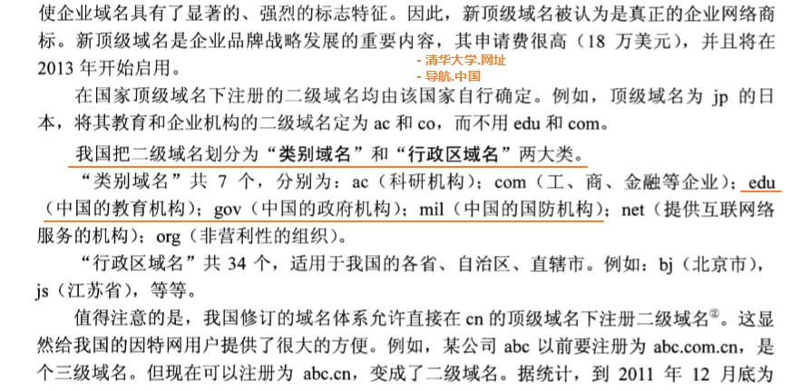
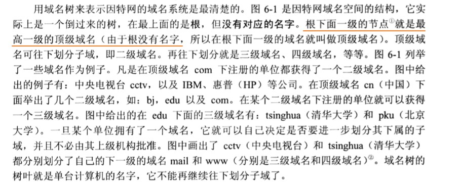
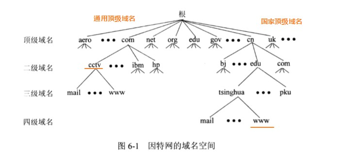
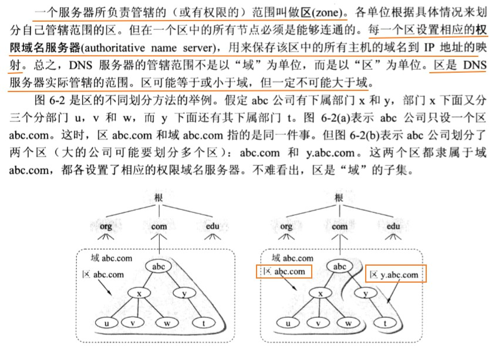

在运输层之上，有一个应用层协议，每个应用层协议都是`为了解决某一类应用问题`，而问题的解决又必须通过位于`不同主机中的多个应用进程之间的通信和协作工作`来完成。应用层的具体内容就是精确定义`这些通信规则`。

应用层应当定义：应用进程交换的`报文类型`，如请求报文和相应报文。

互联网公共领域的标准应用的应用层协议是由RFC文档定义的，大家都可以使用，如HTTP。而互联网中还有其他应用的应用层协议不是公开的，这些协议是`专用`的，如P2P文件共享系统。

应用层的许多协议都是基于`客户服务器(client server)`方式。客户和服务器都是指通信中涉及的两个`应用进程`，只是`客户是服务请求方，而服务器是提供方`。

### 域名系统DNS

域名系统DNS（Domain Name System）是互联网使用的命名系统。主要用于：域名和IP的转换。

域名DNS被设计成一个`联机分布式数据库系统`，并采用`客户服务器`方式。DNS使`大多数名字都在本地进行解析`，仅`少量解析需要在互联网那上通信`，因此DNS系统的效率很高。【本地域名服务器存在缓存，你连接不同的网络，会有不同的本地域名服务器】

关于域名服务器：

- [host和本地域名服务器](https://blog.csdn.net/u010234516/article/details/52963954)
- [域名劫持-百度百科](https://baike.baidu.com/item/%E5%9F%9F%E5%90%8D%E5%8A%AB%E6%8C%81/7657893?fromtitle=DNS%E5%8A%AB%E6%8C%81&fromid=6739044)
- [域名劫持和域名污染](http://www.yunweipai.com/archives/5175.html)

域名到IP地址的解析是由分布在互联网上的许多域名服务器程序（简称域名服务器）共同完成的。而人们也常把运行域名服务器程序的机器称为域名服务器。

域名到IP地址的解析过程：当某一应用进程需要把主机名解析成IP地址时，该应用进程就调用解析程序，并成为一个DNS的一个客户，把待解析的域名放在DNS请求报文中，以`UDP用户数据报`方法发给`本地域名服务器`（使用UDP是为了减少开销）。本地域名服务器在查找域名后，把对应的IP地址放在`回答报文中返回`。应用进程获得目的主机的IP地址后即可进行通信。

#### 互联网的域名结构

互联网采用层次树状结构命名。

